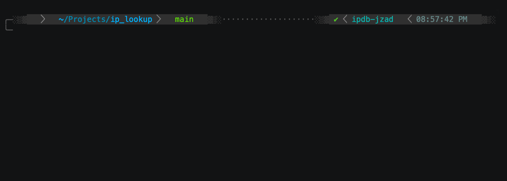

# IP Lookup Tool

Search a reference CSV for an IP Address (using CIDR lookups).

## Features

1. Logging via Loguru
2. Dockerfile to run the script in a container

## Usage

### Running locally

First run to setup virtualenv and run locally with debugging.

```bash
git pull https://github.com/BaDxKaRMa/ip_lookup.git
cd ip_lookup
python -m venv venv
source venv/bin/activate
python -m pip install -r requirements.txt
./src/main.py 10.1.1.1 --debug
```

### Run with Dockerfile

Build image and run

```bash
docker build -t ip_lookup .
docker run ip_lookup:latest 10.1.1.1 --debug
```

## Demo


